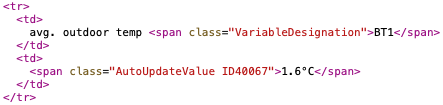

# nibe-mqtt

- Scrape heat pump metrics from Nibe Uplink to MQTT

## Quick HOWTO:


### 1) Discover your hpid and variables:

Go to [www.nibeuplink.com](https://www.nibeuplink.com) and find your hpid and variables here. Useful way is using developer tools in your browser for reverse engeneering of resources of "Service Info" page.  

For example, there is variable 40067 called "avg. outdoor temp":




### 2) Make config file nibe-uplink.yml:

This file contains Nibe Uplink credentials and custom device variables.  
Example for NIBE VVM310 + F2040-12:

```
username: 'login'
password: 'password'
hpid: 12345
variables: [ 40083, 40081, 40079, 40004, 40067, 40033, 40008, 40012, 40013, 40014, 43009, 43005, 43437, 44396, 40782, 44701, 44703, 44396, 44069, 44702, 44699, 44700, 44071, 44073, 40737, 44362, 44058, 44363, 44059, 44060, 44055, 44061, 10014 ]
```

### 3) Run it

#### via docker
```
docker run -v /my/conf:/nibe-mqtt/conf -p 1883:1883 \
vinklat/nibe-mqtt -q MQTT_BROKER_ADDR -p 1883 -c conf/nibe-uplink.yml -l DEBUG
```

#### or
install from PyPI:

`pip install nibe-mqtt`

and run 

`nibe-mqtt -q MQTT_BROKER_ADDR -p 1883 -c conf/nibe-uplink.yml -l DEBUG`

### 4) Subscribe metrics

Metrics are emmited all together in one message in json format.  
Subscribe topic `nibe-uplink/+/R` (or `nibe-uplink/#`)  
Prefix can be changed using -t parameter.

## Credits:
Based on [nibe_downlink](https://github.com/yozik04/nibe_downlink) by [yozik04](https://github.com/yozik04). Thanks.

